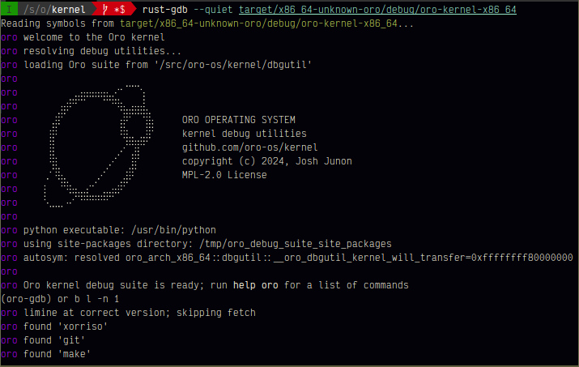

# Oro kernel GDB debug utilities



This is a suite of GDB debugging utilities specifically for the Oro kernel.
They are automatically loaded when opening an Oro kernel variant in
`gdb`, a linux-based debugger.

The utilities help with debugging the Oro kernel via QEMU and performing
high-level operations such as printing the kernel's memory layout, performing
translations, and otherwise introspecting the kernel's state in a way that would
be manually tedious to do, or impossible to do with GDB alone.

Please note that these utilities are NOT intended to be used in production, and
are **SOLELY** for development-time debugging. Further, they are completely
Oro-specific and are not guaranteed to have any usefulness outside of the Oro
ecosystem.

## Usage
To use these utilities, simply open a debug profile variant of the Oro
kernel in GDB.

```shell
rust-gdb -q target/x86_64-unknown-oro/debug/oro-kernel-x86_64
rust-gdb -q target/aarch64-unknown-oro/debug/oro-kernel-aarch64
```

You can then boot directly to the kernel via QEMU with the `oro boot` convenience
commands, like so:

```gdb
help oro boot
oro boot limine
```

> [!IMPORTANT]
> GDB's auto-load functionality is whitelist-based, so by default the
> debug utilities will not load. You will need to add the following line to your
> `~/.gdbinit` file to enable auto-loading of the debug utilities:
>
> ```gdb
> add-auto-load-safe-path /path/to/oro-os/kernel/repo
> ```

> [!TIP]
> `gdb` typically only ships with the host architecture supported. It's recommended
> to build GDB from source with full support for all architectures.
>
> You can do this by running the following commands in the gdb source directory:
> ```shell
> ./configure --enable-targets=all --enable-tui --with-expat --with-python
> make -j$(nproc)
> sudo make install
> ```

## False Positives
In high degrees of symmetric multiprocessing (SMP) or other complex scenarios, GDB
struggles to respond to breakpoints faster than other cores can be paused. Since
the GDB tracker services (e.g. the PFA or lock tracker) use breakpoints to receive
in-kernel events as they happen, more SMP arity can lead to race conditions that,
while innocuous to the actual kernel's execution, can cause dbgutil to report
false positives (e.g. double-alloc PFA events, release-without-acquire lock events,
etc).

If you suspect a false positive, try reducing the number of cores in your QEMU	
invocation, or try running the kernel with a single core. This will reduce the
likelihood that a breakpoint race condition occurs, assuming the symptom you're
trying to debug is still replicable with fewer cores.

The lock, PFA and core ID trackers are disabled by default and can cause overhead in the
kernel's execution when enabled. You can enable some or all of them with the
following commands in GDB:

```
set oro-pfa on
set oro-lock on
set oro-core-id on
```

## Problems

A few common problems:

### Can't find `pip`, but it's installed.

Go into `gdb` and run `python print(sys.executable)`. This will print the
Python installation that `gdb` is using. If it's not the same as the one you
installed `pip` to, make sure to install `pip` using that version.

### Dbgutil is raising an exception, but GDB isn't showing the trace.

```
set python print-stack full
```

If you're running into this often (i.e. when developing on the utilities), you
can add this to your `~/.gdbinit` file.
